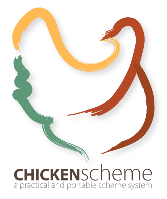
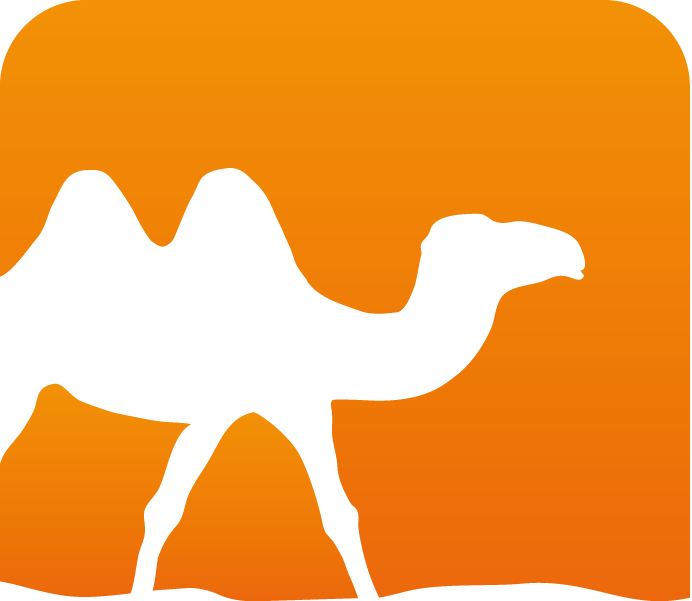
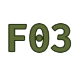

### Hi there 👋

I am a hobbyist programmers passionate about programming languages and open source.
I am also a graduated generalist engineer and computational chemistry 🧪 PhD student.

Since 2012, coding have been one of my main occupation and I am happy to share my experience and ideas !

Most of my new projects will be found on my [Gitlab](https://gitlab.com/Lattay) as I am slowly migrating.

I like working on ephemeral projects for the love of problem solving, but also more durable open source projects.

My interests includes:

* Vim/Neovim plugin
* programming languages design and experimentation
* 👾 game development

